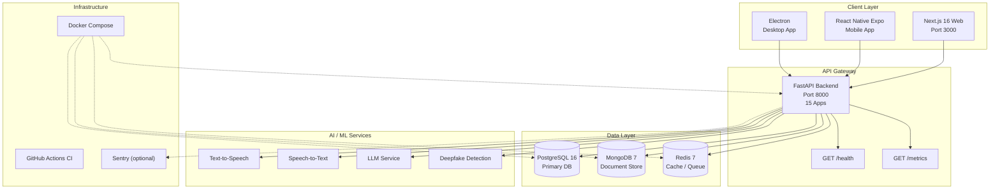
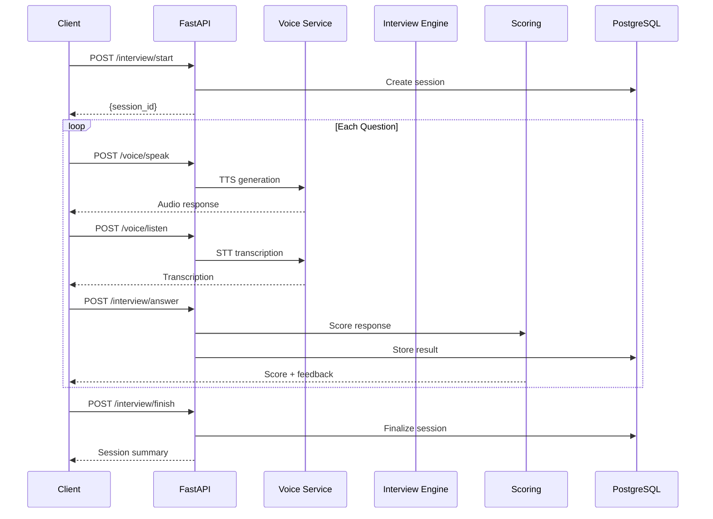

# DutchKem Voice Agent V3 — Architecture

## System Overview



## Backend Apps (`backend/apps/`)

| App | Purpose |
|-----|---------|
| `auth` | JWT authentication, user registration/login |
| `voice` | Voice recording, TTS/STT integration |
| `interview` | Interview session management, question flow |
| `proctoring` | Proctoring rules, face/audio monitoring |
| `coaching` | Real-time coaching feedback |
| `scoring` | Response scoring and evaluation |
| `deepfake` | Deepfake detection on video/audio |
| `modes` | Interview mode configuration |
| `orchestrator` | Multi-service orchestration |
| `analytics` | Usage analytics and reporting |
| `admin` | Admin dashboard endpoints |
| `docs` | API documentation |
| `healer` | System health healing automation |
| `background` | Background task processing |
| `llmlite` | Lightweight LLM inference |

## Data Flow — Interview Session



## Frontend Architecture

```
frontend/
├── web/          # Next.js 16 (App Router, pnpm, TypeScript)
├── mobile/       # React Native Expo (TypeScript)
└── desktop/      # Electron (wraps web build)
```

## Infrastructure

- **Containerization**: Docker Compose (PostgreSQL, MongoDB, Redis, backend, frontend)
- **CI/CD**: GitHub Actions — lint, test, Docker build on push/PR
- **Monitoring**: Sentry integration, Prometheus `/metrics` endpoint
- **Deployment**: Render, Koyeb, Vercel (web), Railway (backend)
